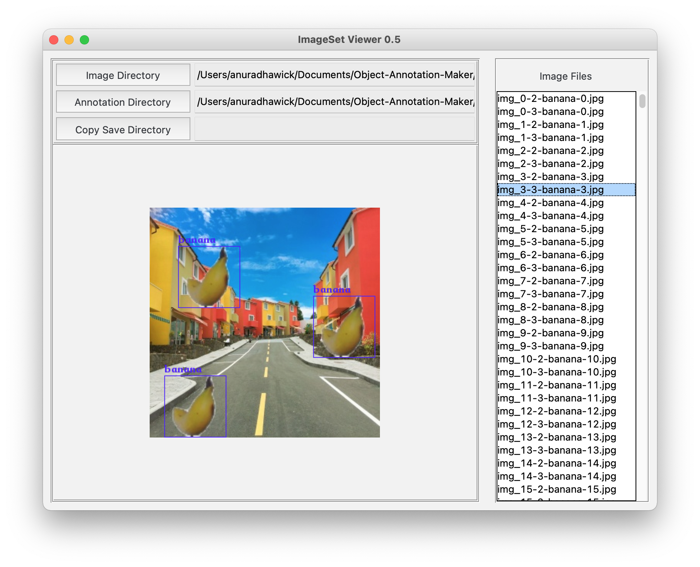

# Object-Annotation-Maker

It is often easier to capture objects as they are with a removable background. However, annotating objects is quite tedious and time consuming. In fact, can be expensive for researchers and students. This project was started with the intention of enabling researchers to use backgrounds and object images to generate annotated images with Pascal VOC format. 

Read this blog if you're interesting: [Medium Blog](https://anuradhawick.medium.com/annotator-for-object-detection-950fd799b651)

## Usage

Code needs to be dowloaded first. Be sure to install the following dependencies if you do not have them already.

```
python-opencv (be able to import cv2)
tqdm for progress bars
numpy
```

### Downloading code

```sh
% git clone https://github.com/anuradhawick/Object-Annotation-Maker.git
% cd Object-Annotation-Maker
% python3 Maker.py
```

### Parameters

You can use the following command to obtain the available parameters.

```
% python3 Make.py -h
```

```
usage: Make.py [-h] --images IMAGES [IMAGES ...] --backgrounds BACKGROUNDS
               [BACKGROUNDS ...] [--remove-backgrounds] [--crop-whites]
               [--resize-images H,W or H] [--resize-backgrounds H,W or H]
               [--resize-ratio 0.5 or 0.2-0.6] [--target-size TARGET_SIZE]
               [--n-images [0-100]] [--n-objects 1,100] [--seed SEED]
               [--threads THREADS] --output OUTPUT

Object Annotation Maker.

This programs enables the creation of bounding boxes with backgrounds for object images.
The project was initiated intending to help computer vision researchers and enthusiasts to perform easy data generation.
Created by Anuradha Wickramarachchi (anuradhawick@gmail.com).

optional arguments:
  -h, --help            show this help message and exit
  --images IMAGES [IMAGES ...], -i IMAGES [IMAGES ...]
                        Images path, can provide wild card. 
                        eg: "/path/img-cars-*.jpg"
                        (Quotation marks are essential)
  --backgrounds BACKGROUNDS [BACKGROUNDS ...], -b BACKGROUNDS [BACKGROUNDS ...]
                        Background images path, can provide wild card. 
                        eg: "/path/img-backgrounds-*.jpg"
                        (Quotation marks are essential)
  --remove-backgrounds, -r
                        Whether to remove white backgrounds or not. 
                        Not required if you have PNG images without backgrounds.
  --crop-whites, -c     Whether to crop out the white margins from images. 
                        Not required if you have PNG images without backgrounds.
  --resize-images H,W or H, -ri H,W or H
                        Convert input images to size before proceeding. Format H,W in pixels without spaces. Or specify only height for scaled resize.
  --resize-backgrounds H,W or H, -rb H,W or H
                        Convert background images to size before proceeding. Format H,W in pixels without spaces. Or specify only height for scaled resize.
  --resize-ratio 0.5 or 0.2-0.6, -rr 0.5 or 0.2-0.6
                        Ratio of object to background. 
                        Use a range or a single value. Overrides resize-image and resize-backgroud options.
                        Use - to separate range values.
  --target-size TARGET_SIZE, -ts TARGET_SIZE
                        Find image size. Format H,W in pixels without spaces.
  --n-images [0-100], -ni [0-100]
                        Number of images to generate per object. Between 1 and 100.
  --n-objects 1,100, -no 1,100
                        Number of objects per image. Range or single value.
  --seed SEED, -s SEED  Random seed for reproducibility.
  --threads THREADS, -t THREADS
                        Number of threads for processing.
  --output OUTPUT, -o OUTPUT
                        Output directory.
```

# Notes
* Image generation with ratios is still under consideration/experimentation. If the utility seems effective it will be immediately rolled out. Or it will be available eventually. Ping me with an issue if it is urgent!

* Verification of annotations can be done using the following tool *if needed*
    ```
    https://github.com/zchrissirhcz/imageset-viewer
    ```

* TODO for non overlapping images/ percentage of overlapping images

# Showcase


